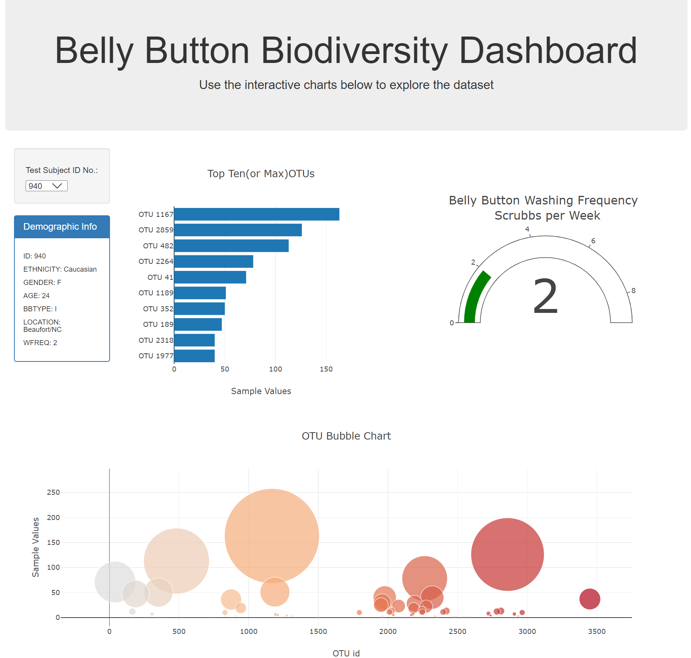
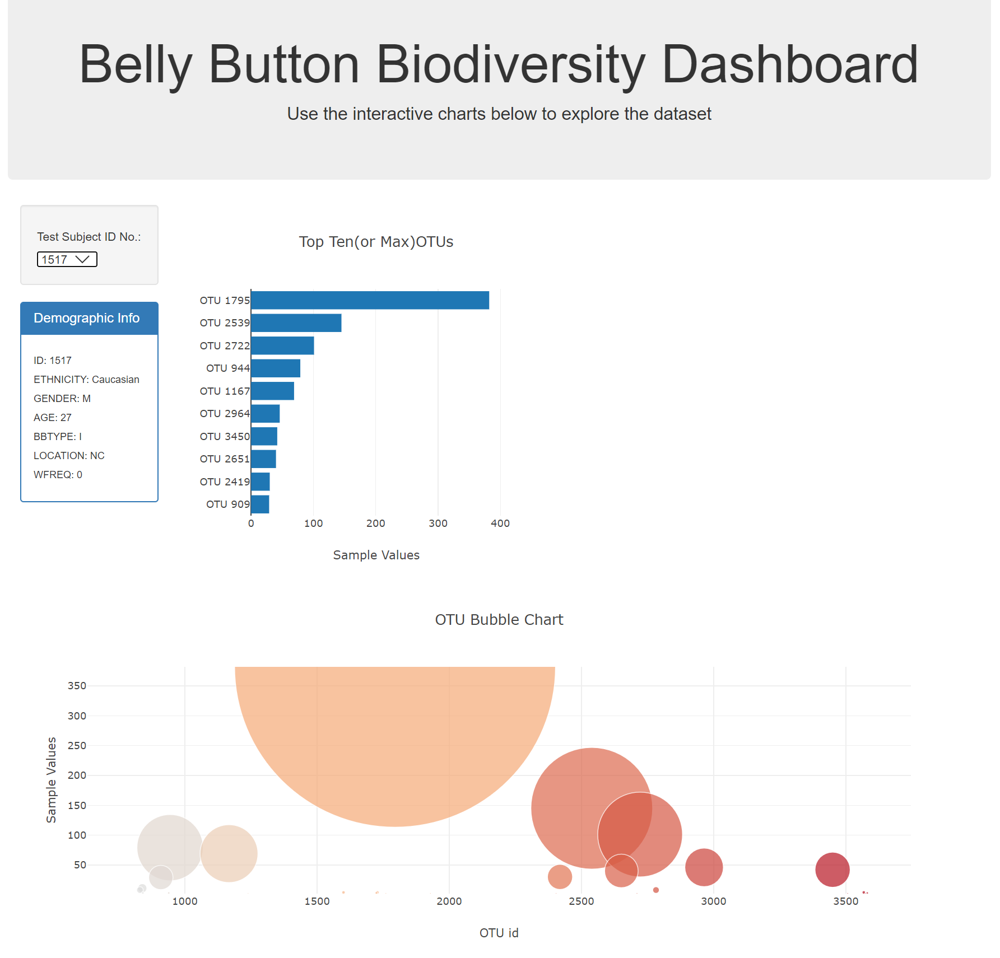

# plotly_deployment

##A. Background
1. We are using plotly scripts to deploy a dashboard.

2. The dashboard will show a summary of the "samples" collected.

3. The information dispalyed includes :

	a. Demographics of the sample provider
	b. Top ten OTUs in the sample in a bar chart
	c. Bubble chart of all the OTUs in the sample
	d. Guage to show washing frequency of the sample holder

##B. Method

1. Used jumbotron / bootstrap style sheets.
2. Plotly and d3 scripts were used for loadingand representing 
data in various formats
3. Javascript was used to detect selection of sample provider.
4. The update function filtered the selected sample from the database
and extracted data like OTU ids, OTU labels, sample_values , washing freq
etc to plot on the web page
5.For displaying the top ten OTUs, the thre key lists OTU ids, 
OTU labels (for hover), sample_size were groupd into an array and 
sorted with OUT ids. This enabled filtering thetop ten and ploting the
bar chart. The original data was used for bubble chart. 
Some key considerations are a) Empty list b) list is less than 10.
**Chart area cleared if list was null**.
6. Demographics was presented with data from metadata. Also washing frequency
was presented with plotly -indicator type model. 

##C. Results

